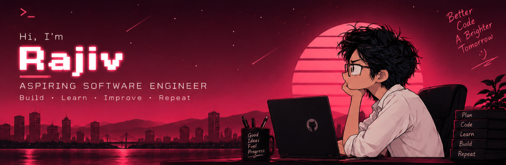

# Hey there, I'm Rajiv M 👋

  
  
  

## 🧑‍💻 About Me

<table align="center">
<tr>
<td align="left">

- 💻 **Software Developer** passionate about building modern web applications. 
- 🌱 Currently improving my skills in **Python, Django, JavaScript & SQL**. 
- 🚀 Building **AI-powered projects** and exploring Open Source development. 
- 🎯 **Goal:** Create products that solve real-world problems. 
- 🌌 Passionate about **AI, Data Science, Machine Learning, and Web Development**. 
- ✨ Always learning, experimenting, and building ideas that make an impact.

</td>
<td align="center">

</td>
</tr>
</table>

---

## 💻 Tech Stack

---

## 📈 GitHub Analytics

  

  

---

## 🐍 Contribution Graph

  

---

## 🌐 Let's Connect

  
  
  

---

**See you in the next commit** 💝

